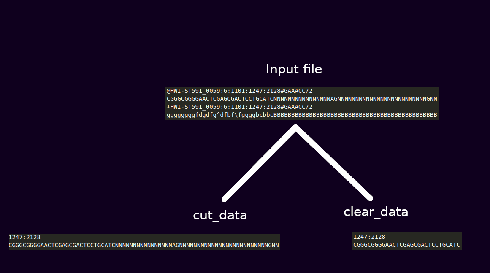

### Команда запуска

```./filter.sh filename```


### Общее описание

Скрипт принимает в качестве аргумента имя `.gz` архива.

Результатом работы являются два файла: в файле `cut_data` содержатся координаты последовательностей нуклеотидов и сами последовательности.

В файле `clear_data` - координаты последовательностей нуклеотидов и наибольшая корректная подпоследовательность.



### Описание работы

1. Распаковывается архив
2. Удаляется информация о качестве
3. Удаляется лишняя информация в строке с координатами и сохраняется в файл `cut_data`
4. В каждой последовательности нуклеотидов выбирается самая длинная корректная подпоследовательность и сохраняется в файл `clear_data`

