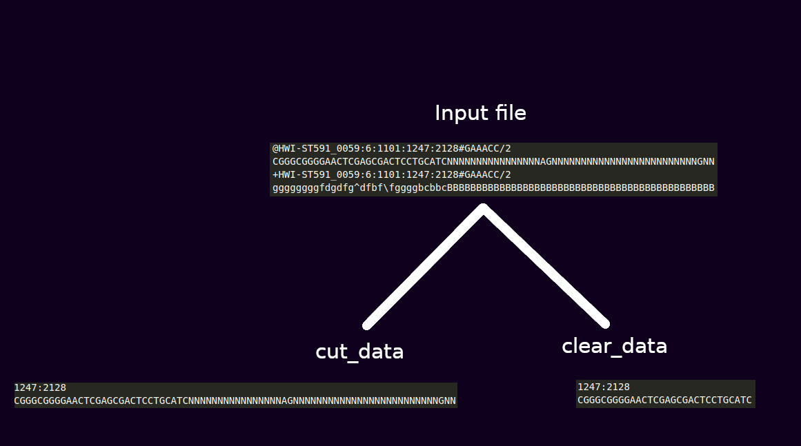

### Команда запуска

```./filter.sh filename len```


### Общее описание

Скрипт принимает два аргумента: имя `.gz` архива и минимальная длина `len` корректной подпоследовательности нуклеотидов.

Результатом работы являются три файла: в файле `cut_data` содержатся координаты всех последовательностей нуклеотидов и сами последовательности.

В файле `clear_data` - координаты последовательностей нуклеотидов и наибольшая корректная подпоследовательность, удовлетворяющая длине `len`.

Если длина наибольшей корректной подпоследовательности меньше `len`, то информация об этой последовательности сохраняется в файл `deleted_data`.



### Описание работы

1. Распаковывается архив;
2. Удаляется информация о качестве;
3. Удаляется лишняя информация в строке с координатами и сохраняется в файл `cut_data`;
4. В каждой последовательности нуклеотидов выбирается самая длинная корректная подпоследовательность и сохраняется либо в файл `clear_data`, либо в `deleted_data`.

